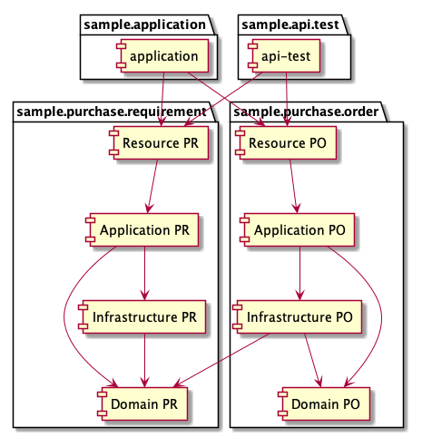

# ddd-china-2019-sample
## Description
I want to make this project coule be one of DDD style code solution, which is drived by the principles of the DDD tactical design and implement.  
Also the project will contains the CI/CD, static check and other basic code base infrastructure requirement.  

### The Principles

- Domain-Oriented Layer
- Non Technology Pollution Of Domain Object
- Clean Architecture

### The Things To Do

- [x] the package is organized by Aggregation
- [ ] the layer (api, application service, domain, infrastructure) should be one-way dependence
- [ ] the domain layer should be centered
- [ ] the technology implement should be in the infrastructure layer
- [ ] spring boot + Jersey + mybatis + MySql
- [ ] local infrastructure deployment
- [ ] the example of DDD build block to implement in the tech case
- [ ] CI/CD and others

### Code Architecture Solution
#### Layer Principles
Thanks to microsoft

#### Architecture of one boundary context 
Base on Layer Principles and Aggregation-Organized Principles

## Installation
this repo is base on spring boot, so the work solution is same as the spring boot defaults.

## Reference

- [microsoft DDD oriented micro-service](https://docs.microsoft.com/en-us/dotnet/architecture/microservices/microservice-ddd-cqrs-patterns/ddd-oriented-microservice)
- [Domain model validation](https://colinjack.blogspot.com/2008/03/domain-model-validation.html)
